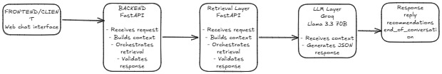

# SHL Conversational Assessment Recommender

An AI-powered conversational recommendation system that helps recruiters and hiring managers discover relevant SHL assessments through natural language conversations.

Built as part of the SHL AI Intern Take-Home Assignment.

---

## Features

- Conversational assessment recommendation
- Semantic search using FAISS + Sentence Transformers
- Context-aware multi-turn conversations
- Assessment refinement during conversation
- Structured JSON responses
- FastAPI backend
- Groq LLM integration
- Stateless API design
- Deployed on Render

---

## Architecture

The system follows a Retrieval-Augmented Generation (RAG) pipeline:

1. User query received through FastAPI
2. Query embedded using Sentence Transformers
3. FAISS retrieves top relevant SHL assessments
4. Groq LLM generates grounded conversational response
5. Structured recommendations returned as JSON

<h2 align="center">Architecture</h2>

<p align="center">
  
</p>

### Tech Stack

- FastAPI
- Sentence Transformers (`all-MiniLM-L6-v2`)
- FAISS
- Groq API
- Python
- Uvicorn
- Render

---

## API Endpoints

### Health Check

```http
GET /health
```

Response:

```json
{
  "status": "ok"
}
```

---

### Chat Endpoint

```http
POST /chat
```

Request:

```json
{
  "messages": [
    {
      "role": "user",
      "content": "I am hiring a Java backend developer"
    }
  ]
}
```

Response:

```json
{
  "reply": "Here are some suitable assessments for a Java backend developer.",
  "recommendations": [
    {
      "name": "Java 8 (New)",
      "url": "https://www.shl.com/",
      "test_type": "K"
    }
  ],
  "end_of_conversation": false
}
```

---

## Project Structure

```bash
SHL_Assessment_Consultant/
│
├── backend/
│   ├── main.py
│   ├── engine.py
│   ├── prompts.py
│   ├── models.py
│   ├── faiss_index.bin
│   ├── metadata.pkl
│   └── __init__.py
│
├── data/
│   └── shl_catalog.json
│
├── requirements.txt
├── runtime.txt
├── README.md
└── .env
```

---

## Installation

### Clone Repository

```bash
git clone https://github.com/YOUR_USERNAME/SHL_Assessment_Consultant.git
cd SHL_Assessment_Consultant
```

---

### Create Virtual Environment

```bash
python -m venv venv
```

Activate environment:

#### Windows

```bash
venv\Scripts\activate
```

#### Linux/Mac

```bash
source venv/bin/activate
```

---

### Install Dependencies

```bash
pip install -r requirements.txt
```

---

## Environment Variables

Create a `.env` file:

```env
GROQ_API_KEY=your_api_key_here
```

---

## Run Locally

```bash
python -m uvicorn backend.main:app --reload
```

API available at:

```bash
http://127.0.0.1:8000
```

Swagger Docs:

```bash
http://127.0.0.1:8000/docs
```

---

## Deployment

Deployed using Render.

### Start Command

```bash
python -m uvicorn backend.main:app --host 0.0.0.0 --port $PORT
```

---

## Semantic Retrieval Pipeline

### Offline Indexing

- SHL catalog scraped and cleaned
- Relevant fields combined into text chunks
- Embeddings generated using Sentence Transformers
- FAISS index created and stored

### Online Retrieval

- User conversation converted into embedding
- FAISS retrieves top-K similar assessments
- LLM generates grounded recommendation response

---

## Evaluation Approach

The system was tested on:

- vague queries
- refinement queries
- comparison requests
- off-topic prompts
- multi-turn conversations

Evaluation focused on:
- relevance of recommendations
- grounded responses
- conversational coherence
- schema compliance
- retrieval accuracy

---

## Challenges Faced

- Reducing hallucinations from the LLM
- Keeping responses grounded to SHL catalog only
- Deployment memory constraints with FAISS + transformers
- Cold start delays on free hosting

---

## Future Improvements

- Better reranking pipeline
- Hybrid keyword + vector retrieval
- Streaming responses
- Conversation summarization
- Advanced evaluation metrics

---

## Deployment URL

```bash
https://shl-assessment-consultant.onrender.com/
```

---

## Author

Shraddha Tiwari

AI/ML Enthusiast | FastAPI | NLP | RAG Systems
